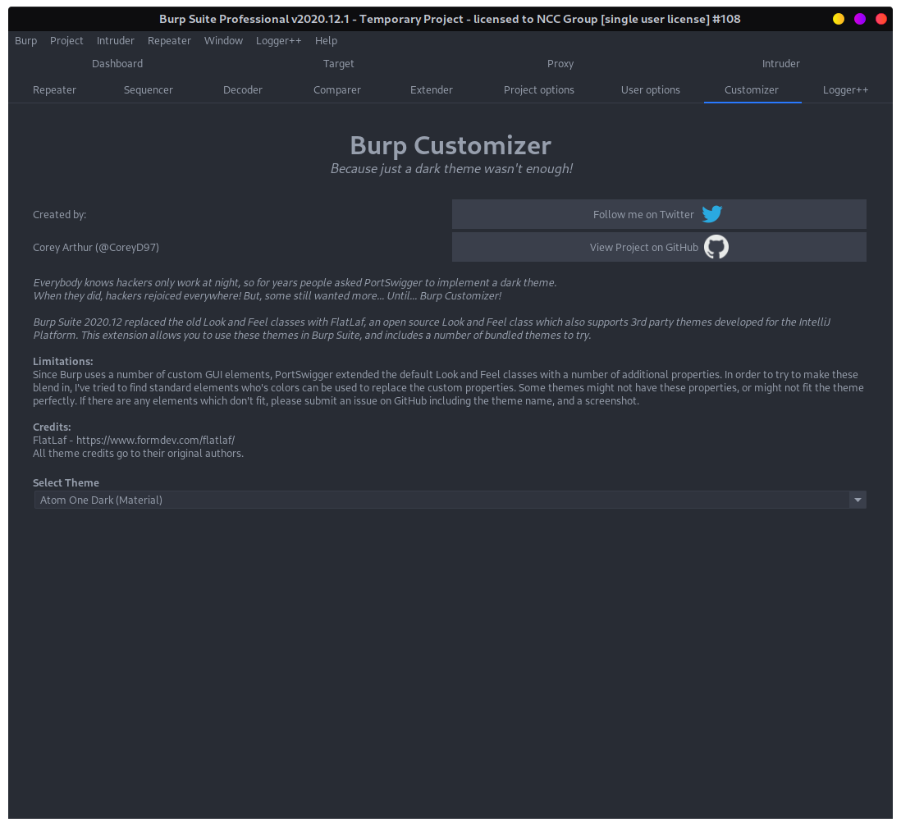
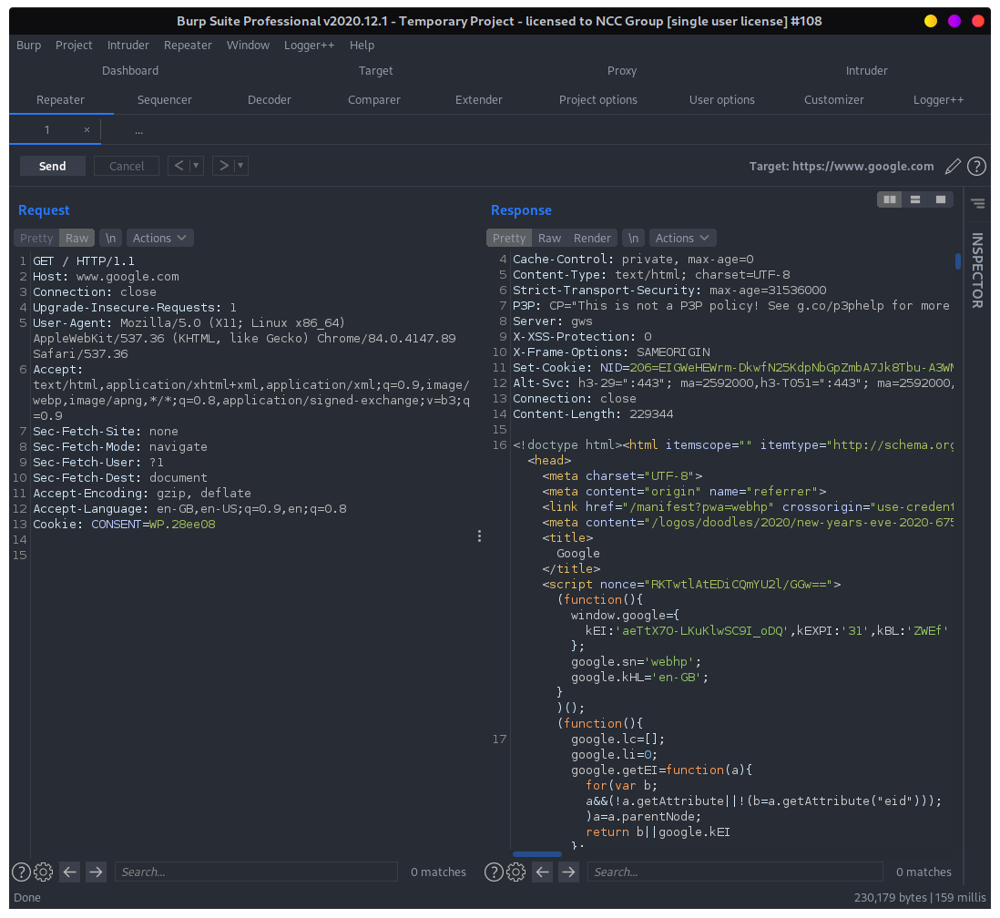
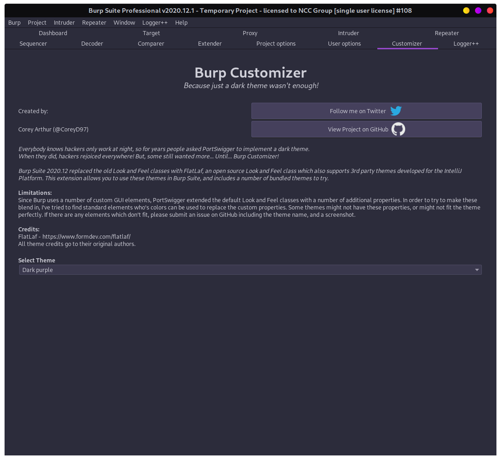
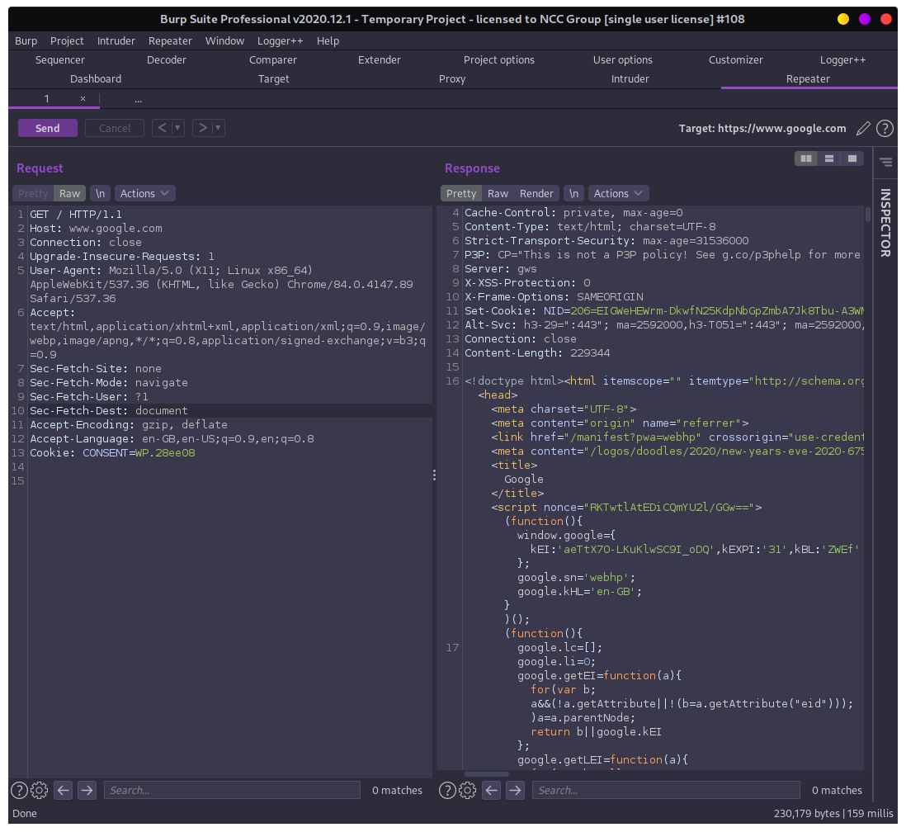
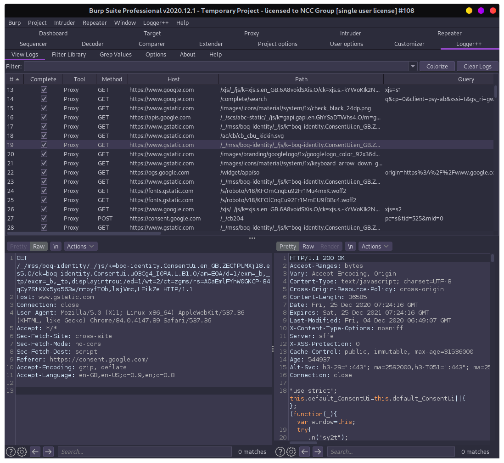

  <h1 align="center">Burp Customizer</h1>
  <h5 align="center">Because just a dark theme wasn't enough!</h5>

  
  
  
  
  

**Created By: CoreyD97 **

_Everybody knows hackers only work at night, so for years people asked PortSwigger to implement a dark theme.
When they did, hackers rejoiced everywhere! But, some still wanted more... Until... Burp Customizer!_  

Burp Suite 2020.12 replaced the old Look and Feel classes with FlatLaf, an open source Look and Feel class
which also supports 3rd party [themes developed for the IntelliJ Platform][1]. This extension allows you to use
these themes in Burp Suite, and includes a number of bundled themes to try.

[1]:https://github.com/JFormDesigner/FlatLaf/tree/main/flatlaf-intellij-themes

**Images:**
<table>
<tr><td>Atom One Dark</td>
<td>

</td>
<td>

</td>
<td>

</td></tr>
<tr><td>Dark Purple</td>
<td>

</td>
<td>

</td>
<td>

</td></tr>
<tr>
<td colspan="4" align="right">And 56 more themes!</td>
</tr>
</table>

**Limitations:**  
Since Burp uses a number of custom GUI elements, PortSwigger extended the default
Look and Feel classes with a number of additional properties. In order to try to make these blend in, I've
tried to find standard elements who's colors can be used to replace the custom properties. Some themes might
not have these properties, or might not fit the theme perfectly. If there are any elements which don't fit,
please submit an issue on GitHub including the theme name, and a screenshot.

**Future Plans:**
* Allow loading from `.theme.json` files
* Allow manual specification of additional defaults an overrides

**Credits:**  
FlatLaf - https://www.formdev.com/flatlaf/  
All theme credits go to their original authors.

---

### Installing:
1. Download the latest jar from https://github.com/CoreyD97/BurpCustomizer/releases
2. Add the jar to Burp Suite.

### Usage:
1. Select the correct base theme from Burp's "User options -> Display" menu, to set the correct icon pack.
2. Choose a theme from within the Burp Customizer tab.
3. If you like the project, please give the repo a star! <3

---

### Building:
If you want to build the project from source, e.g. for tweaking, or development
1. Clone the repo
2. Use gradle to build the jar: `gradle jar`
3. Add the built jar (`./releases/BurpCustomizer.jar`) to Burp Suite
